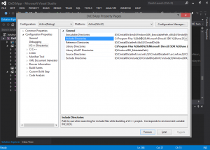
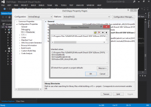
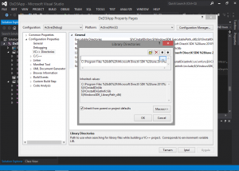

<<<<<<< HEAD
#Win32 Penceresinin oluşturulması
=======
#Directx11' e Giriş

Merhaba arkadaşlar C/C++ dersleri devam ederken aynı zaman da vaktimin yettiğince directx11 anlatmaya çalışacağım.
>>>>>>> 92b23ef55abc524b180d5cf57244291e892b514d

Merhaba arkadaşlar bugün Directx’ e giriş yapıyoruz. Kodlarımızı yazarken bir framework yapısı oluşturmaya çalışacağız bu sayede daha anlaşılır kodlar ve ürettiğimiz sınıfları daha hızlı deneme imkanı elde edeceğiz.

<<<<<<< HEAD
Kodların her birini dersi hazırlarken elimle yazdığım için bazı yazım hataları olabilir onları bana bildirirseniz sevinirim.
Aynı zamanda buradaki dersleri github hesabım üzerinden de visual studio projeleri ile birikte yayınlayacağım. Ordan da takip edebilirsiniz.
=======
##Directx Nedir?
Directx, Microsoft’ un video oyunları başta olmak üzere çoklu ortam yazılımlarını rahat, hızlı ve uyumlu şekilde hazırlayabilmek için yarattığı bir API yazılım programlama arayüzüdür. Şu andaki en güncel resmi sürümü Directx12′ dir.
>>>>>>> 92b23ef55abc524b180d5cf57244291e892b514d

<<<<<<< HEAD
Bugünkü dersimizde bir tane win32 windows penceresini oluşturacağız.
=======
[Directx SDK](https://www.microsoft.com/en-us/download/details.aspx?id=6812)
>>>>>>> 92b23ef55abc524b180d5cf57244291e892b514d

##Framework

<<<<<<< HEAD
Gördüğünüz gibi yapımız bu şekilde başlayacak olup ileriki derslerde de üzerine koyacağız. Öncelikle class yapısını küçük bir anlatayım.

- Input classı bizim klavye işlemlerimizi yapıcak olan class.
- Graphics classı Direct3D fonksiyonlarını çalıştıracak olan class
- Core classı çekirdek işlemler için ve temelde win32 penceremizi oluşturan class
- Şimdi classlara kodlarımızı yazalım. Öncelikle yeni bir proje oluşturalım.

Ben her dosya içine kütüphane dosyalarını yazmamak için bir tane header dosyası oluşturup gerekli .lib dosyalarını , .h dosyaları, define tanımlamalarını bu dosya içine yapıyorum.

###Resource.h
=======
##Kurulum

Öncelikle Visual Studio ortamını açıp File->New->Project diyerek yeni bir C++ projesi oluşturunuz.
Daha sonra “Solution Explorer” kısmında proje ismine sağ tıklayıp “Properties” kısmına tıklayın.
“Configuration” kısmını “Active(Debug)”, “Platform” ise “Active(Win32)” yapınız.
“Configuration Properties” kısmından “VC++ Directories” kısmına tıklayınız.
“Include Directories” kısmına gelin kenarda açılan oka tıklayıp edit kısmına basın.

Üstteki “New Line” Kısmına tıklayın. Ve açılan kısımda … olan buton var ona basın.

>>>>>>> 92b23ef55abc524b180d5cf57244291e892b514d

//
// Win32 Header Dosyaları
#include <Windows.h> 
// Win32 işlemleri için header dosyamız.
 
//
// Define
#define WIN32_LEAN_AND_MEAN 
// Bu tanımlama şuan için gerekli
// değil ama bulunmasında fayda var
// bu tanım belirli win32 fonksiyonlarını ve kütüphanelerini 
// Projede derlenmesini sağlıyor.
#define BOOL_KEYS 256 
// Input sınıfımız da bu kısma geleceğiz.
// Klavyedeki tuşların sayısı temsil ediyor.
#define SCREEN_DEPTH_1000 1000.0f
#define SCREEN_NEAR_0001 0.1f
// Bunlar ise görülebilecek en yakın
// ve en uzak uzaklık değerleri
Resource.h Dosyamız şimdilik bu kadar yeri geldikçe buraya eklemeler yapacağız.
Şimdi ise geçelim Input sınıfımıza..

<<<<<<< HEAD
###Input.h

Dediğimiz gibi Input sınıfında klavye işlemlerimizi yapacağız. Hangi tuşlara basıldığını anlamamız için bir dizimiz bulunuyor. BOOL_KEYS uzunluğunda. Eğer tuşa basıldıysa dizideki değerini true yapıyoruz. Basılı değil ise false olarak bırakıyoruz. Bu şekilde hangi tuş veya tuşlara basıldığını anlıyoruz.

Input.h

#pragma once
 
#ifndef INPUT_H
#define INPUT_H
 
#include "Resource.h" 
// Hazırladığımız header 
// dosyasını çağırıyorum.
 
class Input {
    public:
        Input();   
        ~Input(); 
     
        void Initialize(); 
        // Elimizdeki dizi elemanlarını
        // false' a setleyecek fonksiyon.
        void KeyDown(unsigned int);
        // Bir Tuşa basıldıysa dizi 
        // Elemanı true yapıcak
        void KeyUp(unsigned int);
        // Tuş bırakıldığında ise
        // Elemanı false yapıcak..
         
        bool IsKeyDown(unsigned int);
        // Sorduğumuz bir tuşa basılımı
        // Değil mi söyleyecek..
    private:
        bool _keys[BOOL_KEYS];
        // Tuşları tutacak olan dizi.
         
};
 
#endif //!INPUT_H

###Input.cpp

Class dosyasımızı hazırladık şimdi fonksiyonlarımızı yazalım. Olduğunca çok yorum satırı kullanarak yazmaya çalışıyorum lütfen öğrenmek istiyorsanız kopyala-yapıştır yapmayınız. Kendiniz bakarak yazmaya çalışınız ki eliniz alışsın.

Input.cpp

#include "Input.h"
 
Input :: Input() {
}
 
Input :: ~Input() {
}
 
void Input :: Initialize() {
    for(int i = 0; i < BOOL_KEYS; i++) 
        _keys[i] = false; 
    // İlk bütün değerleri false' a
    // setliyoruz.
}
 
void Input :: KeyDown(unsigned int _key) {
    _keys[_key] = true;
    // Basilan tuşun dizideki yerini
    // true yapıyoruz.
}
void Input :: KeyUp(unsigned int _key) {
    _keys[_key] = false;
    // Bıralan tuşun dizideki yerini
    // false yapıyoruz.
}
 
bool Input :: IsKeyDown(unsigned int _key) {
    return _keys[_key];
    // Sorduğumuz tuşa basılıp
    // basılmadığını öğreniyoruz..
}
Şuanlık Input sınıfımız bu kadar ama ileride DirectInput fonksiyonlarını bu sınıfımız içinde yazacağız.

##Graphics.h

Şimdi geçelim grafik sınıfımıza şuanlık Directx11 ayarlamalarını yapmadığımız için burası boş duracak. Sadece fonksiyonları yazacağız.

Graphics.h

#pragma once
 
#ifndef GRAPHICS_H
#define GRAPHICS_H
 
#include "Resource.h"
 
const bool IsFullScreen  = false;
// Pencerenin Tam ekran veya
// Belirli bir boyutta seçilebilmesi
const bool IsVsyncEnable = true;
// Vsync özelliğinin seçimi
const float ScreenDepth  = SCREEN_DEPTH_1000;
const float ScreenNear   = SCREEN_NEAR_0001;
// En uzak ve yakın görülebilecek
// uzaklık..
 
class Graphics {
    public:
        Graphics();
        ~Graphics();
 
        bool Initialize(int, int, HWND);
        // Ekran setlemelerini yapacak olan fonksiyon.
        // Directx penceresinin hangi pencerede
        // ve boyutlarının ne olacağını alıp
        // işlemler yapacak..
        void ShutDown();
        // Pencerenin kapanırken ki işlemlerini yapacak
        // olan fonksiyon (Belleği temizleyecek)..
        bool Frame();
    private:
        bool Render();
        // Bu iki fonksiyon ana döngü her
        // Döndüğünde çağrılacak olan fonksiyonlar.
        // mantıksal işlemleri ve grafiksel çizimleri
        // yapacak olan fonksiyon..
};
 
#endif //!GRAPHICS_H

###Graphics.cpp

Class dosyası bu kadar şimdi class fonksiyonlarımızı yazalım.

###Graphics.cpp

#include "Graphics.h"
 
Graphics :: Graphics() {
}
 
Graphics :: ~Graphics() {
}
 
bool Graphics :: Initialize(int x_iScreen, int y_iScreen, HWND _hwnd) {
    return true;
}
 
void Graphics :: ShutDown() {
 
}
 
bool Graphics :: Frame() {
    return true;
}
 
bool Graphics :: Render() {
    return true;
}
Evet arkadaşlar büyük bir kısmı bitirdik gördüğünüz gibi şimdilik bu sınıfımız boş framework yapımızı tamamlaması için hazırladık. Bir sonraki dersimizde ise içini doldurmaya başlayacağız.

###Core.h

Şimdi ise geldi sırada penceremizi oluşturacak sınıfı yazmaya. Bu sınıfta windows mesajlarını yakalayan bir sınıfımız olacak. Bu ne demek? Mesela ESC tuşuna basıldığında penceremizin kapanmasını istiyoruz. Input sınıfı bizim için ESC tuşuna basıldığını buluyor. Biz ise Core sınıfında bunu belirtiyoruz. ESC tuşuna basıldığında kapan mesajını yolla, bu mesaj alınıyor ve bir işleme giriyor. Bunun sonucunda penceremiz kapanıyor.

Pencere özelliklerini belirlediğimiz bir sınıfımız olacak. Pencere iconu, başlığı, rengi gibi

Şimdi geçelim kodumuza.

Core.h

#pragma once
 
#ifndef CORE_H 
#define CORE_H
 
#include "Input.h"
#include "Graphics.h"
#include "Resource.h"
 
static LRESULT CALLBACK WndProc(
    HWND,
    UINT,
    WPARAM,
    LPARAM);
// Bizim programımıza gelecek olan 
//mesajları işleyecek olan fonksiyondur.
 
class Core {
    public:
        Core();
        ~Core();
 
        bool Initialize();
        // Her zaman ki gibi bizim için
        // Ayarlamaları yapıcak ve pencere 
        // oluşturacak fonksiyonu çağracağımız yer..
         
        void ShutDown();
        // Bellek temizlemeleri
        // Yapacak olan fonksiyon..
        void Run();
        // Hiç bir Kısımda sorun oluşmamış ise
        // Ana döngümüzü başlatacak olan fonksiyon..
         
        LRESULT CALLBACK MessageHandler(
            HWND,
            UINT,
            WPARAM,
            LPARAM);
        // Windowstan gelen mesajları kontrol edecek 
        // olan fonksiyon..
    private:
        bool Frame();
        // Run Fonksiyonunun her bir dönüşünde
        // çağırılacak olan fonksiyon..
         
        void InitializeWindow(int&, int&);
        // Penceremizi ayarlayacak ve 
        // çalıştıracak olan fonksiyon.
        void ShutDownWindow();
        // Penceremizi kapatacak olan fonksiyon..
    private:
        LPCSTR     _mApplicationName;
        // Pencere adımız..
        HINSTANCE  _mApplicationHInstance;
        // Uygulamamızın hinstance değeri
        HWND       _mApplicationHwnd;
        // Pencere değerini tutar..
         
        Input*    p_AppInput;
        Graphics* p_AppGraphics;
        // Input ve Graphics sınıflarını
        // Kullanabilmemiz için.
};
 
static Core* p_ApplicationHandle;
 
#endif // !CORE_H 
Burda anlatmamız gereken önemli bir nokta var fark ettiğseniz WndProc ve MessageHandler fonksiyonlarının başında CALLBACK diğe bir çağırım var.

CALLBACK aslında windowsun bir fonksiyon çağırım mekanizmasıdır.(Function Calling Convention) Peki Nedir bu fonksiyon çağırım merkezi. Bu fonksiyon bir kod parçasından bir kaç parametre alacak ve windows tarafından çağırılıp sonuç olarak bir çıktı üretecektir. Fonksiyona parametre geçirebilmek için duruma göre registerlar veya stacklar kullanılır. Fakat bazı durumlarda parametrelerin stack üzerinde nasıl yer aldığını bilmemiz gerekir. İşte bu bilgileri bize fonksiyon çağırım merkezi belirler.

###Core.cpp

Şimdi geldi sıra fonksiyonlarımızı yazmaya. Bu kısım bizim penceremizi her şeyiyle oluşturacak olan kısım.

###Core.cpp

#include "Core.h"
 
Core :: Core() {
    p_AppInput             = NULL;
    p_AppGraphics          = NULL;
    p_ApplicationHandle    = NULL;
      
    p_ApplicationHandle    = this;
 
    _mApplicationHInstance = GetModuleHandle(NULL);
    _mApplicationName      = "Directx11 Ders2"; 
}
 
Core :: ~Core() {
}
 
bool Core :: Initialize() {
    int x_iScreen, y_iScreen;
    bool result;
 
    x_iScreen = 0;
    y_iScreen = 0;
 
    InitializeWindow(x_iScreen, y_iScreen);
    p_AppInput = new Input;
    if(!p_AppInput)
        return false;
 
    p_AppInput->Initialize();
    // Input sınıfından bir nesne türettik
    // Ve Input sınıfındaki diziyi setledik.
 
    p_AppGraphics = new Graphics;
    if(!p_AppGraphics)
        return false;
 
    result = p_AppGraphics->Initialize(x_iScreen, y_iScreen, _mApplicationHwmd);
    if(!result)
        return false;
    // Graphics sınıfından yeni bir nesne türettik
    // boyutlarımızı ve penceremizi verdik.
    return true;
}
 
void Core :: ShutDown() {
    if(p_AppInput){
        delete p_AppInput;
        p_AppInput = NULL;
    }
    // Eğer Input Nesnesi duruyor ise 
    // Bellekten temizledik.
     
    if(p_AppGraphics) {
        p_AppGraphics->ShutDown();
        delete p_AppGraphics;
        p_AppGraphics = NULL;
    }
    // Eğer Graphics Nesnesi duruyor ise
    // Bellekten temizledik.
 
    ShutDownWindow();
    // Ve her şey tamamsa penceremizi kapattık.
}
 
void Core :: Run() {
    MSG msg;
    bool done, result;
 
    ZeroMemory(&msg, sizeof(msg));
    // Bellekten mesajlar için
    // Yerimizi ayırdık..
     
    done = false;
    while(!done) {
        if(PeekMessage(&msg, NULL, 0, 0, PM_REMOVE)) {
             // PeekMessage Gelen mesajları denetler
             // Eğer mesaj varsa mesajı alır.
             TranslateMessage(&msg);
             // Gelen mesajı
             // Anlayacağı türe çevirir.
             DispatchMessage(&msg);
             // Mesajı Gönderir.
        }
        if( msg.message == WM_QUIT )
             done = true;
             // Eğer gelen mesaj WM_QUIT ise
             // döngüyü durdururuz..
       else {
             result = Frame();
             if(!result)
                 done = true;
             // Eğer her şey doğruysa
             // Frame çalışır.
       }
    }
}
 
bool Core :: Frame() {
    // Bu kısmı artık anlıyorsunuz zaten..
    bool result;
    // VK_ESCAPE ESC tuşu..
    if(p_AppInput->IsKeyDown(VK_ESCAPE))
        return false;
 
    result = p_AppGraphics->Frame();
    if(!result)
        return false;
 
    return true;
}
LRESULT CALLBACK Core :: MessageHandler(HWND _hwnd, UINT _message, WPARAM _wParam, LPARAM _lParam) {
    // Tuşa basılmasını yakalayan windows mesajları..
    switch (_message) {
        case WM_KEYDOWN:
            p_AppInput->KeyDown((unsigned int)_wParam);
            return 0;
            // Eğer tuşa basıldıysa 
            // Değerini al Input sınıfına yolla.
     case WM_KEYUP:
        p_AppInput->KeyUp((unsigned int)_wParam);
        return 0;
            // Eğer bırakıldıysa
            // Yine Input sınıfına yolla.
     default:
        return DefWindowProc(_hwnd, _message, _wParam, _lParam);
            // Hiç bir tuşa basılmadıysa..
            // Geri kalan mesajları işle..
    }
}
 
void Core :: InitializeWindow(
    int& x_iScreen, 
    int& y_iScreen) {
 
    // Windows kütüphanesindeki pencere sınıfı.
    WNDCLASSEX wc;
    DEVMODE d_mScreenSettings;
 
    int xPosition, y_Position;
     
    // Pencere sınıfının özelliklerini atıyoruz.
    wc.style            = CS_HREDRAW | CS_VREDRAW | CS_OWNDC;
    wc.lpfnWndProc      = WndProc;
    wc.lpszClassName    = _mApplicationName;
    wc.lpszMenuName = NULL;
    wc.hCursor      = LoadCursor(NULL, IDC_ARROW);
    wc.hIcon        = LoadIcon(NULL, IDI_WINLOGO);
    wc.hIconSm      = wc.hIcon;
    // Ekran Rengimizi atıyoruz..
    wc.hbrBackground    = (HBRUSH)GetStockObject(BLACK_BRUSH);
    wc.hInstance    = _mApplicationHInstance;
    wc.cbSize       = sizeof(WNDCLASSEX);
    wc.cbClsExtra   = NULL;
    wc.cbWndExtra   = NULL;
     
   RegisterClassEx(&wc);
   // Atadığımız değerleri işleme sokuyoruz..
 
   x_iScreen = GetSystemMetrics(SM_CXSCREEN);
   y_iScreen = GetSystemMetrics(SM_CYSCREEN);
   // Ekran çözünürlüklerini öğreniyoruz..
  
   if(IsFullScreen) {
        // Eğer Full ekran seçili ise
        memset(&dm_ScreenSettngs, 0 , sizeof(dm_ScreenSettngs));
    dm_ScreenSettngs.dmSize     = sizeof(dm_ScreenSettngs);
    dm_ScreenSettngs.dmPelsWidth    = (unsigned long)x_iScreen;
    dm_ScreenSettngs.dmPelsHeight   = (unsigned long)y_iScreen;
    dm_ScreenSettngs.dmBitsPerPel   = 32;
    dm_ScreenSettngs.dmFields   = DM_BITSPERPEL | DM_PELSWIDTH | DM_PELSHEIGHT;
 
    ChangeDisplaySettings(&dm_ScreenSettngs, CDS_FULLSCREEN);
 
    xPosition = 0;
    yPosition = 0;
         
        // Pencereyi başlatacak olan fonksiyon.
    _mApplicationHwnd = CreateWindowEx(
            WS_EX_APPWINDOW,
            _mApplicationName,
        _mApplicationName,
        WS_CLIPSIBLINGS | WS_CLIPCHILDREN | WS_POPUP,
        xPosition,
        yPosition,
       x_iScreen,
       y_iScreen,
           NULL,
       NULL,
       _mApplicationHInstance,
       NULL);
    }
    else {
        x_iScreen = 800;
        y_iScreen = 600;
 
    xPosition = (GetSystemMetrics(SM_CXSCREEN) - x_iScreen)/ 2;
    yPosition = (GetSystemMetrics(SM_CYSCREEN) - y_iScreen)/ 2;
 
    _mApplicationHwnd = CreateWindowEx(
        NULL,
        _mApplicationName,
        _mApplicationName,
        WS_CLIPSIBLINGS | WS_CLIPCHILDREN | WS_POPUP | WS_OVERLAPPEDWINDOW,
        xPosition,
        yPosition,
        x_iScreen,
            y_iScreen,
        NULL,
        NULL,
        _mApplicationHInstance,
        NULL);
    } 
    ShowWindow(_mApplicationHwnd, SW_SHOW);
    SetForegroundWindow(_mApplicationHwnd);
    SetFocus(_mApplicationHwnd); 
}
 
void Core :: ShutDownWindow() {
    // Bu kısımda fonksiyon
    // isimlerinden belli olduğu
    // için çok fazla açıklama yapmadım
    if(IsFullScreen)
        ChangeDisplaySettings(NULL, 0);
 
    DestroyWindow(_mApplicationHwnd);
    _mApplicationHwnd = NULL;
 
    UnregisterClass(_mApplicationName, _mApplicationHInstance);
    _mApplicationHInstance = NULL;
}
 
LRESULT CALLBACK WndProc(HWND _hwnd, UINT _message, WPARAM _wParam, LPARAM _lParam) {
    // Mesajları alıp işleme koyacak olan fonksiyonumuz..
    switch (_message) {
        case WM_DESTROY:
        PostQuitMessage(0);
        return 0;
     case WM_CLOSE:
        PostQuitMessage(0);
        return 0;
     default:
         return p_ApplicationHandle->MessageHandler(_hwnd, _message, _wParam, _lParam);
    }
}
Evet Class yapılarımıza ait bütün fonksiyonlar şimdilik bu kadar. Artık bazı kısımları anlamış olduğunuzu düşünüyorum. Bu yapı önemli yapıyı iyi kavradığınız zaman geri kalan kısımlar üzerine çok güzel oturacaktır.

Şimdi ana fonksiyonumuzu yazalım.

###WinMain.cpp

#include "Resource.h"
#include "Core.h"
 
int WINAPI WinMain(HINSTANCE hInstance, HINSTANCE prevHInstance, PSTR cmdShowLine, int cmdShow){
    Core* core;
    bool result;
 
    core = new Core;
    if(!core)
        return 0;
 
    result = core->Initialize();
    if(result)
        core->Run();
 
    core->ShutDown();
    delete core;
    core = NULL;
    return 0;
}
=======
##Egzersiz

- Örnek olarak SDK dosyası içerisindeki bazı kodları çalıştırıp bakabilirsiniz. \Samples\C++\Direct3D11\Tutorials
>>>>>>> 92b23ef55abc524b180d5cf57244291e892b514d
